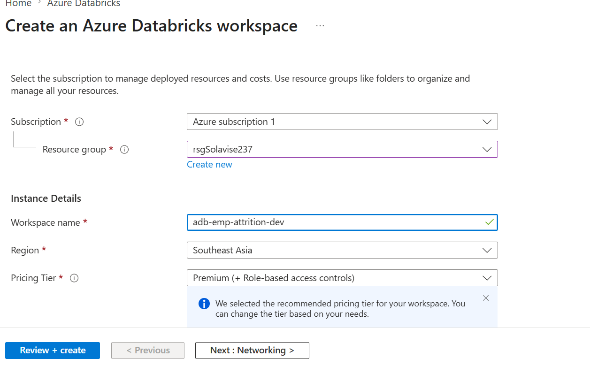
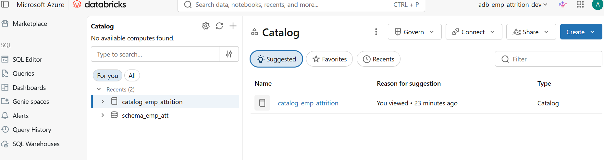
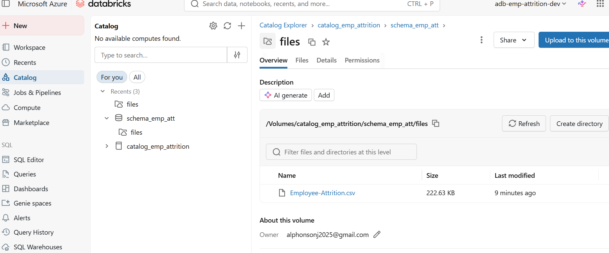

# Employee Attrition Data Engineering Project (Databricks Medallion Architecture)

## 📌 Project Overview
This project demonstrates an end-to-end Data Engineering pipeline using the Medallion Architecture (Bronze, Silver, Gold) in Databricks.
The goal is to analyze employee attrition data and generate business insights using scalable data processing techniques.

Technologies used:
- Databricks  (with unity catalog for data governance)
- PySpark     (data processing)
- Delta Lake  (storage layer)
- SQL         (analytic and transformations)

- ## 📂 Unity Catalog Implementation

This project uses Unity Catalog to manage data governance, organization, and access control in Databricks.

### Structure Used:
- **Catalog**: `catalog_emp_attrition`
- **Schema**: `schema_emp_att`
- **Volume**: `empattvol`

### Purpose:
- Centralized data management across layers (Bronze, Silver, Gold)
- Secure and governed data access
- Organized storage for structured data pipelines

### Data Storage Path:
/Volumes/catalog_emp_attrition/schema_empatt/empattvol/

### Layers:
- Bronze → Raw data ingestion
- Silver → Cleaned and transformed data
- Gold → Business-ready aggregated data
- 

-## 📌 **Catalog & Schema Setup (Unity Catalog)**

This screenshot shows the successful creation of the project’s data structure in Databricks using Unity Catalog.
A catalog named catalog_emp_attrition was created to group all project-related data assets
A schema named schema_emp_att was created within the catalog to organize datasets
This setup establishes a clear and scalable foundation for managing data across the Medallion Architecture (Bronze, Silver, Gold).

# Data Upload to Volume

This step confirms the successful upload of the raw dataset into the Unity Catalog volume.
The dataset Employee-Attrition.csv was uploaded into the volume
The file is stored within the schema under the volume (displayed as “files” in the Databricks UI)

