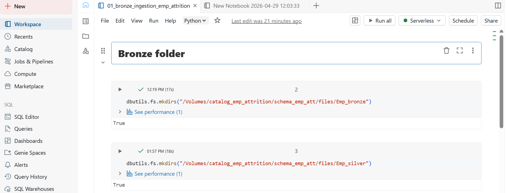
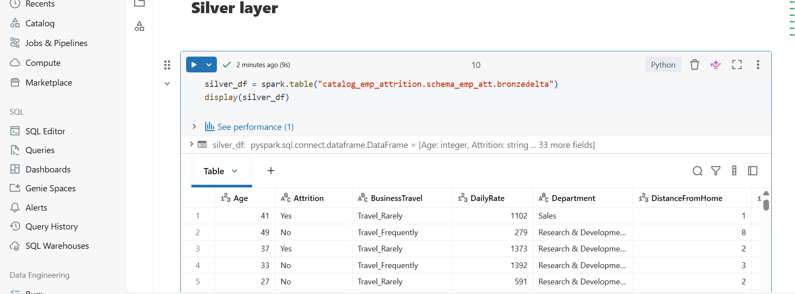
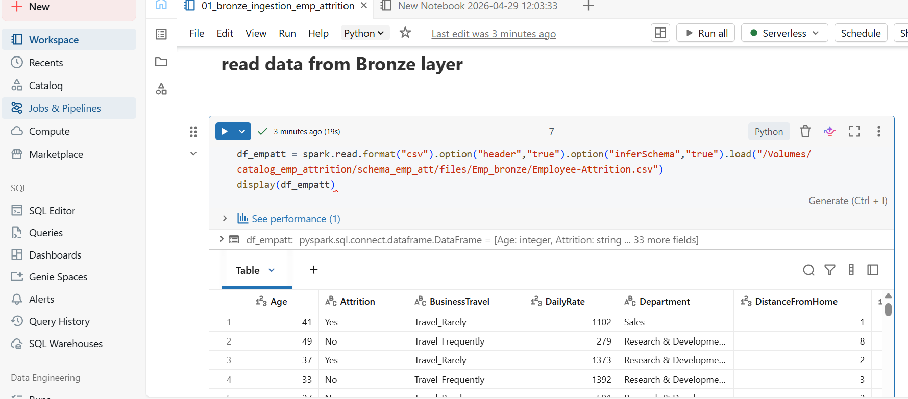
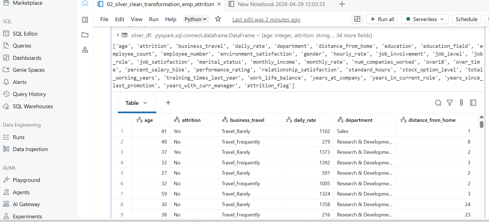
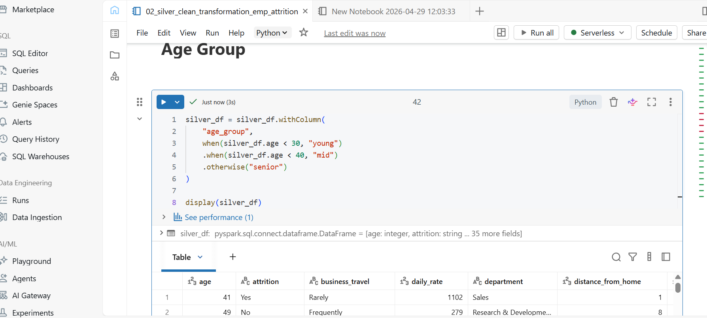
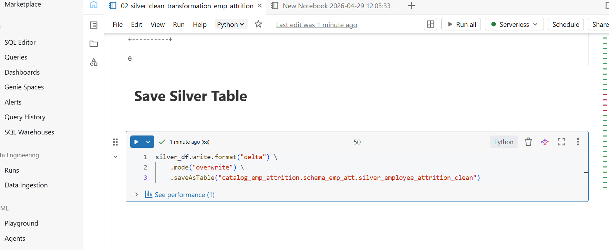
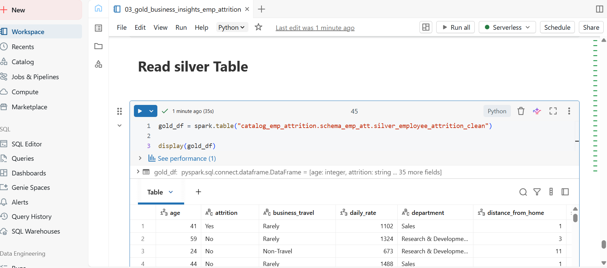
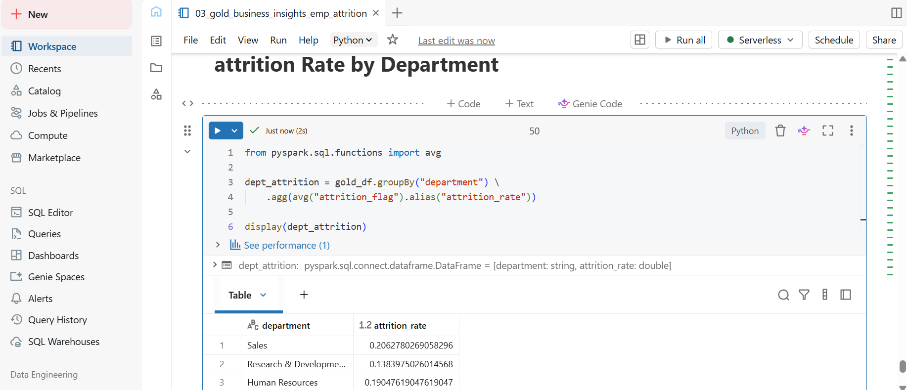
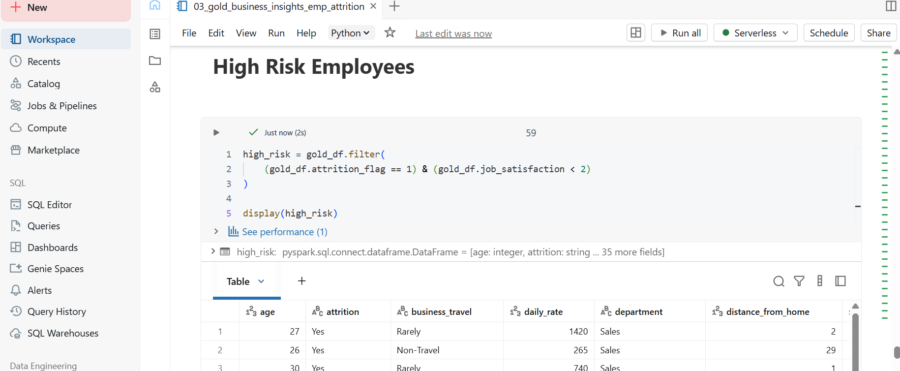

# Employee Attrition Data Engineering Project (Databricks Medallion Architecture)

## 📌 Project Overview
This project demonstrates an end-to-end Data Engineering pipeline using the Medallion Architecture (Bronze, Silver, Gold) in Databricks.
The goal is to analyze employee attrition data and generate business insights using scalable data processing techniques.

Technologies used:
- Databricks  (with unity catalog for data governance)
- PySpark     (data processing)
- Delta Lake  (storage layer)
- SQL         (analytic and transformations)

- ## 📂 Unity Catalog Implementation

This project uses Unity Catalog to manage data governance, organization, and access control in Databricks.

### Structure Used:
- **Catalog**: `catalog_emp_attrition`
- **Schema**: `schema_emp_att`
- **Volume**: `empattvol`

### Purpose:
- Centralized data management across layers (Bronze, Silver, Gold)
- Secure and governed data access
- Organized storage for structured data pipelines

### Data Storage Path:
/Volumes/catalog_emp_attrition/schema_empatt/empattvol/

### Layers:

- Bronze → Raw data ingestion
- Silver → Cleaned and transformed data
- Gold → Business-ready aggregated data
- 

- **Catalog & Schema Setup (Unity Catalog)**

This screenshot shows the successful creation of the project’s data structure in Databricks using Unity Catalog.
A catalog named catalog_emp_attrition was created to group all project-related data assets
A schema named schema_emp_att was created within the catalog to organize datasets
This setup establishes a clear and scalable foundation for managing data across the Medallion Architecture (Bronze, Silver, Gold).

# Data Upload to Volume

This step confirms the successful upload of the raw dataset into the Unity Catalog volume.
The dataset Employee-Attrition.csv was uploaded into the volume
The file is stored within the schema under the volume (displayed as “files” in the Databricks UI)

**📂Bronze Layer – Raw Data Ingestion**

The raw employee attrition dataset is successfully ingested into the Bronze layer, serving as the foundation of the Medallion Architecture.
This layer preserves data in its original format, ensuring traceability and enabling downstream transformations.
Highlights:
Ingestion into Unity Catalog Volume
Organized storage structure for scalability
Supports batch processing workflows

***Step 1: Create Medallion Folders Using PySpark***

🔧 ***Code***

To implement the Medallion Architecture, directories were created inside the Unity Catalog Volume using PySpark utilities.

🔧**Code**
dbutils.fs.mkdirs("/Volumes/catalog_emp_attrition/schema_emp_att/emp_bronze")
dbutils.fs.mkdirs("/Volumes/catalog_emp_attrition/schema_emp_att/emp_silver")
dbutils.fs.mkdirs("/Volumes/catalog_emp_attrition/schema_emp_att/emp_gold")

This step creates three layers for structured data processing:
Bronze Layer (emp_bronze) → Stores raw, unprocessed data
Silver Layer (emp_silver) → Stores cleaned and transformed data
Gold Layer (emp_gold) → Stores aggregated, business-ready data

📌 **Step 2: Verify Folder Structure in Unity Catalog**

📌 **Step 3: Read Data from Bronze Layer**

After uploading the dataset into the Bronze layer, the next step is to read the raw data using PySpark.

🔧 **Code**

df_empatt = spark.read.format("csv") \
    .option("header", "true") \
    .option("inferSchema", "true") \
    .load("/Volumes/catalog_emp_attrition/schema_emp_att/files/Emp_bronze/Employee-Attrition.csv")

display(df_empatt)

🧠 **Explanation**

This step reads raw CSV data from the Bronze layer into a PySpark DataFrame:
header = true → Uses the first row as column names
inferSchema = true → Automatically detects data types
load() → Reads data from Unity Catalog Volume

👉 At this stage, data remains unprocessed and in its raw format, which aligns with the Bronze layer principles in Medallion Architecture.

This approach ensures scalability and aligns with modern lakehouse architecture best practices using Unity Catalog and Delta Lake.

📊 **Output Preview**

The DataFrame preview confirms that:
Data is successfully loaded
Schema is correctly inferred
Dataset is ready for transformation (Silver layer)

🟤 **Bronze Layer – Data Ingestion**

The Bronze layer represents the raw ingestion of employee attrition data into Delta Lake using Databricks.
At this stage, data is ingested as-is without transformations to preserve the original dataset for traceability and auditing.

🔹 **Step 1: Load Raw Data**

The dataset was loaded into a Spark DataFrame for processing.

**Step 2: Write Data to Delta Table**

The raw data was stored as a Delta table using the following approach:

df_empatt.write.mode("overwrite") \
.saveAsTable("catalog_emp_attrition.schema_emp_att.bronze_emp_attrition")

🔹**Step 3: Delta Table Created**

The table was successfully created in Unity Catalog as a managed Delta table.

✅ **Key Features**

Stored in Delta Lake format
Supports ACID transactions
Enables time travel & versioning
Acts as the single source of truth (raw data)

🥈 **Silver Layer – Data Cleaning & Transformation**

📌 **Objective**

Transform raw Bronze data into a clean, structured, and analytics-ready dataset by applying standardization, cleaning, and feature engineering

🔹 **Step 1: Read Bronze Table**

Load raw data from the Bronze layer as the foundation for all transformations. This ensures traceability and consistency across the pipeline.

---

🔹 **Step 2: Inspect Original Columns**

Analyze the dataset structure to identify inconsistencies such as naming issues, casing differences, and formatting challenges.

---

🔹 **Step 3: Column Standardization**

Convert all column names into snake_case to enforce consistency, improve readability, and align with data engineering standards.

---

🔹 **Step 4: Validate Clean Column Names**

Verify that all column names have been successfully standardized and are ready for downstream transformations.

---

🔹 **Step 5: Schema Validation**

Inspect and validate the schema to ensure correct data types and structural integrity before applying further transformations.

---

🔹 **Step 6: Handle Missing Values**

Improve data quality by replacing null values in critical categorical columns:

- **"education_field"** → **"other"**
- **"job_role"** → **"unknown"**

This ensures completeness and prevents issues during analysis.

---

🔹 **Step 7: Standardize Categorical Values**

Normalize categorical data by removing inconsistencies such as prefixes (e.g., "Travel_") to ensure uniformity across records.

---

🔹 **Step 8: Feature Engineering**

Enhance analytical capability by creating derived columns:

- **"attrition_flag"** → converts Yes/No into binary (1/0)
- **"age_group"** → segments employees into meaningful categories

---

🔹 **Step 9: Data Type Enforcement**

Ensure all columns are assigned appropriate data types to support accurate computations and analysis.

---

🔹 **Step 10: Remove Duplicates**

Eliminate duplicate records to maintain data integrity and avoid biased analytical results.

---

🔹 **Step 11: Data Quality Checks**

Validate dataset reliability through key checks:

- Null value verification
- Detection of invalid entries (e.g., age < 18)

---

🔹 **Step 12: Save Silver Table**

Persist the cleaned and transformed dataset as a Delta table for downstream consumption in the Gold layer.

---

📦 **Output Table**

**"silver_employee_attrition_clean"**

---

**🚀 Silver Layer Conclusion**

The Silver layer represents a critical transformation stage where raw data is refined into a trusted, high-quality dataset. By enforcing consistency, improving data quality, and introducing analytical features, this layer ensures that downstream processes operate on reliable and meaningful data.

This structured approach reflects real-world data engineering practices and showcases the ability to build robust, scalable, and business-ready data pipelines, making it highly valuable for analytical workloads and decision-making in the Gold layer.

🥇 **Gold Layer – Business Insights & Aggregations**

📌 **Objective**

Transform cleaned Silver data into business-level insights through aggregations and analytical modeling to support decision-making.

---

🔹 **Step 1: Read Silver Table**

Load the cleaned dataset from the Silver layer.

---

🔹 **Step 2: Attrition Summary**

Provide a high-level overview of employee distribution based on attrition status.

---

🔹 **Step 3: Attrition by Department**

Analyze attrition trends across departments to identify high-risk areas.

---

🔹 **Step 4: Attrition by Gender**

Understand gender-based attrition patterns.

---

🔹 **Step 5: Attrition by Age Group**

Evaluate attrition trends across employee age segments.

---

🔹 **Step 6: High Risk Employees**

Identify employees with high likelihood of leaving based on low satisfaction and attrition indicators.

---

📦**Output Tables**

- "gold_attrition_summary"
- "gold_attrition_by_department"
- "gold_attrition_by_gender"
- "gold_attrition_by_age_group"
- "gold_high_risk_employees"

---

💡 **Business Insights**

- Departments with higher attrition rates require attention
- Younger employees show higher turnover trends
- Low job satisfaction is a key driver of attrition

---

🚀 **Gold Layer Conclusion**

The Gold layer transforms curated data into actionable insights, enabling stakeholders to make informed decisions. It represents the final stage of the data pipeline where data is fully optimized for analytics, reporting, and dashboarding.
